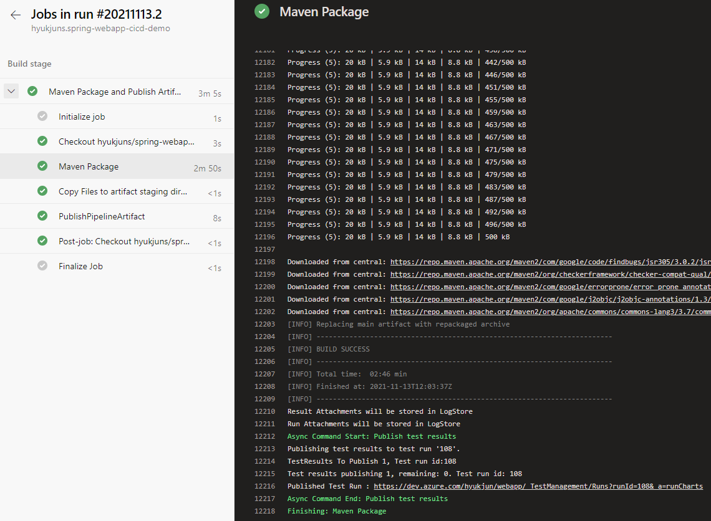
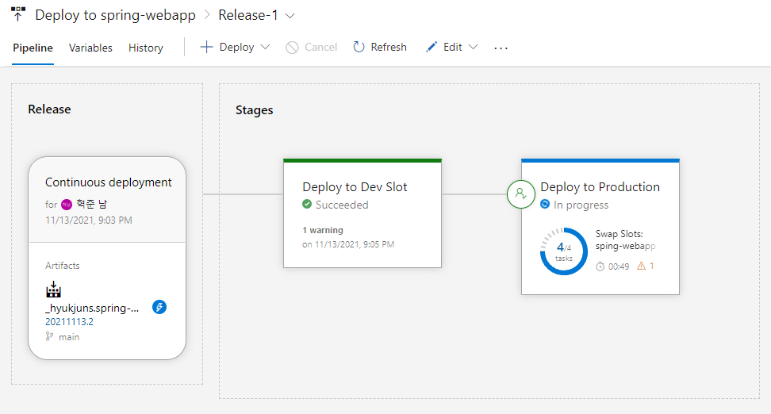
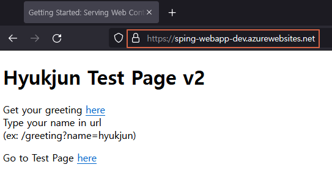
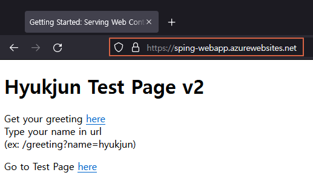

# Spring Web Application CI/CD Demo
[](https://dev.azure.com/hyukjun/spring-demo/_build/latest?definitionId=30&branchName=main)

## 요약
Azure DevOps를 사용해 Spring Framework Web application을 빌드하고, Azure App Service - Webapp에 배포하는 CI/CD 데모
## 데모 환경
- Spring Framework Project
    - Spring Initailizer
        - Maven Project
        - Java Version: 8 (OpenJDK 1.8)
        - Spring Boot: 2.4.5
        - Packaging: War
        - Dependancies   
            - Spring Web
            - Thymeleaf
            - Spring Boot DevTools
- Azure
    - App Service
        - Webapp (Java)
            - Slot: Production, Dev
            - Runtime stack: Tomcat 9.0 (TOMCAT|9.0-jre8)
- Azure DevOps (CI/CD Platform)
    - CI: Pipelines
    - CD: Releases
## 데모 시나리오
### CI - Build Pipeline (azure-pipelines.yml)
1. Source PR & Merge
2. Trigger Build Pipeline
3. Maven Build and Test
4. Publish Artifact(.WAR)



### CD - Release Pipeline
1. Automated Triggered Release Pipeline
2. (Approve/Deny) Deploy to Dev Slot 
3. (Approve/Deny) Swap Slots (Dev and Production)



### Result
#### Dev Slot



#### Production Slot



---
## 데모 사용시 참고
## mvnw Command
### Run
#### mvnw
```
mvnw spring-boot:run
```
#### war
```
java -jar <WARFILE>.war
```
### Build
```
mvnw package
```
### Java Command
Compile -> .class
```
javac <JAVAFILE>.java
```
Excuting Class
```
java <ClassName>
```
Excuting JAR or WAR
```
java -jar <FILENAME>.jar or <FILENAME>.war 
```
#### Maven Build
1. POM.xml
Maven Build시 WAR 파일 이름 설정 필요
```
<finalName>ROOT</finalName>
```
#### Reference
[Spring GetStarted](https://spring.io/guides/gs/serving-web-content/)
 
